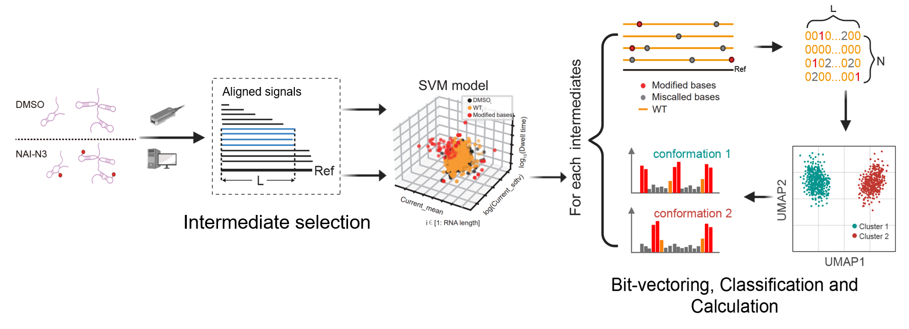

# DeCoRE
## Deconvolute the complex RNA structure ensemble from Nanopore direct RNA sequencing data.
The RNA structural heterogeneity and mixing of truncated RNA complex the RNA structure ensemble and make it a non-trivial task in RNA structure probing. Nanopore direct RNA sequencing that integrated with chemical probing method was used to determine the secondary strucure of long RNA. Chemical probing reagents, such as NAI-N3 and Aclm, preferentially modified the open RNA bases and alter the current signals, resulting in miscalled bases or correctly called bases but with current signal outliers compared with unmodified bases. We used machine learning model to obtain the modification bases on each reads from the Nanopore sequencing data and integrated with the miscalled bases to analyze the RNA structural heterogeneity.
NanoDISH consists of four parts: process the signal data, select reads by their length, obtain the modification profile of each modified reads, classify reads and calculate the reactivaty scores. The modification profiles were converted into 0-1-2 digital vectors and classified using Gaussian Mixture or DBSCAN method. The reactivity scores of each group were calculated and normalized individually. 



### The dependent programs to run the analysis:
- graphmap2(https://github.com/lbcb-sci/graphmap2) or minimap2(https://github.com/lh3/minimap2) to align the Nanopore reads to reference.
- samtools(https://www.htslib.org) to deal with the sam/bam files.
- nanopolish(https://github.com/jts/nanopolish)


### The dependent Python packages:
- os
- argparse
- pandas
- numpy
- OneClassSVM in sklearn.svm
- UMAP in sklearn.decomposition 
- GaussianMixture in sklearn.mixture
- DBSCAN in sklearn.cluster
- mean in statistics


step 1: Dataprocessing.
--------------------------------------------
In this step, the fastq reads were mapped to reference genome using grphmap2 or minimap2 and the fast5 signals were aligned to the reference RNA using nanopolish. The erroneously called redundant signals in event file were collapsed into one with recalculating the mean value of Current_mean, Current_sdtv and the sum value of Dwell time. The output file is an event file with no redundant signals. The modified and unmodified group should be deal with separatly. 

```
python dataprocessing.py  -r ref.fasta -q mod.fastq   -s mod_fast5   -d Mod   -n mod 
python dataprocessing.py  -r ref.fasta -q unmod.fastq -s unmod_fast5 -d Unmod -n Unmod

```

step 2: intermidiates selection. 
-------------------------------
If the raw sequencing reads are mixed with various length of RNA intermediates, this step could separate the reads into individual groups which corresponding to intermediates. The reads were grouped according to their mapping positions on refenrence. -i: the event file from step 1. -s: the start mapping site. Reads whose 5 terminal truncated beyond the start site were excluded. -e: the end mapping site; -b: the allowed length bias of end mapping positions. e.g., if e=100 and b=20, which means the reads whose end mapping sites ranged in 100-120 belong to one intermediate.  If users want to select all the intermediates that shorter than the specific intermediate at the same time, -multi should be used. e.g., if s=30,e=100,b=20 and -m, which means the reads whose end mapping position ranged in (30-40,40-60,60-80,80-100,100-120) were specified to 5 intermediates individually.

```
python pickIntermediate.py -i Mod/mod.collapsed.event  -g TPP -d Mod/mod_multi -s 30 -e 340 -b 20 -m
python pickIntermediate.py -i Unmod/Unmod.collapsed.event  -g TPP -d Unmod/Unmod_multi -s 30 -e 340 -b 20 -m
```

step3: Making modification profile vectors.
--------------------------------------------
In this step, The event files from both modified and unmodified group were used to obtain the modification status of each bases and convert the miscalled and modified bases into digital vectors. The output files (one *.static and two *.profile.vect files) were written to the same path of --Mod_Event. The signal features used in the SVM model could be assigned though --columns (the default value is [4,5,6], where 4 represent for Current_mean, 5 for Current_stdv and 6 for Dwell time). The default --kernel is (rbf), the default --gamma is (0.01) and the default --nu is (0.01).For example, for the TPP roboswitch RNA intermediate with length in 340-360 nt,we may use the command like this:

```
python predictModbase.py -m Mod/mod_multi/TPP_340.event -u Unmod/Unmod_multi/TPP_340.event -l 340 -b 20 
```

step4: Deconvolute the RNA structural heterogeneity and calculate the reactivity scores.
--------------------------------------------
We classify the digital vectors from Mod group using UMAP and Gaussian Mixture or DBSCAN method to deconvolute the RNA structural heterogeneity. For each indivadual cluster, the modify-ratios for each base was calculated with the ratio of modified bases plus the delta ratios of miscalled bases, based on the two digital vectors form step3. Then the modify-ratios were normalized to reactivity scores using Winsorization algorithm. The result files include a clustering figure in PDF and a reactivity score file in txt. The reactivity scores of RNA can be also calculated without thinking about its structural heterogeneity(s=mean). 
```
python scoreIntermediate.py -m Mod/mod_multi/TPP_340.event.evct -u Unmod/Unmod_multi/TPP_340.event.vect -o Mod/mod_multi/TPP_340 -l 340 -b 20 -s heter
```
During the running of the program, the user needs to view the temporarily produced UMAP file and specify the cluster number and clustering method.

